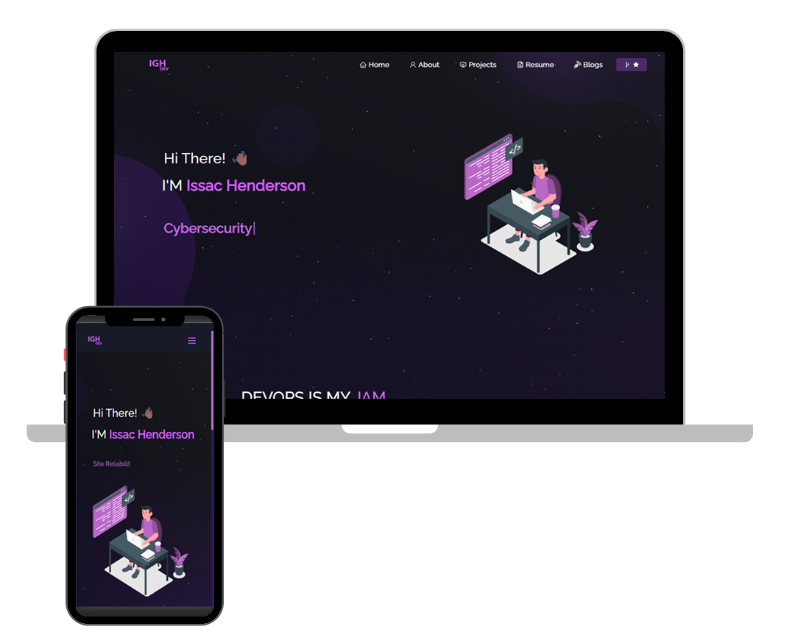

# Portfolio Website - v2.0

[Live Demo](https://www.issachendersondev.com/)

## TL;DR

You can fork this repo to modify and make changes of your own. Please give me proper credit by linking back to [Ihend47](https://github.com/Ihend47/Portfolio). Thanks!

## Built With

My personal portfolio [https://www.issachendersondev.com/](https://www.issachendersondev.com/) which features some of my GitHub projects as well as my resume and technical skills.

This project was built using these technologies:

- React.js
- Node.js
- Express.js
- CSS3
- VsCode
- Vercel

## Features

- **Multi-Page Layout**
- **Styled with React-Bootstrap and CSS with easy-to-customize colors**
- **Fully Responsive**

## Getting Started

Clone down this repository. You will need `node.js` and `git` installed globally on your machine.

## Installation and Setup Instructions

1. Installation: `npm install`
2. In the project directory, you can run: `npm start`

Runs the app in the development mode.
Open [http://localhost:3000](http://localhost:3000) to view it in the browser. The page will reload if you make edits.

## Usage Instructions

Open the project folder and navigate to `/src/components/`.
You will find all the components used, and you can edit your information accordingly.

## Report Bug or Request Feature

Feel free to report any bugs or request new features by opening an issue [here](https://github.com/ihend47/Portfolio/issues).# devportfilio-
